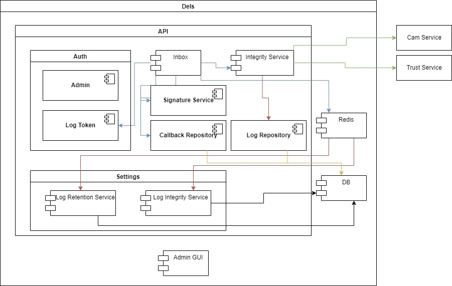
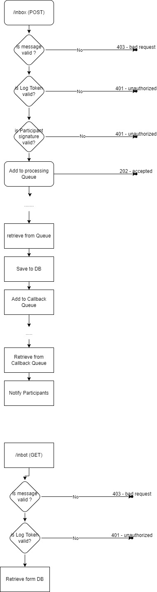

# Gaia-X DEL Documentation

The Gaia-X Federation Service Data Exchange Logging Service (GX-DELS) provides evidence that data has
been (a) submitted and (b) received and (c) rules and obligations (Data Usage Policies) were enforced or
violated. This supports the clearing of operational issues, but also eventually the clearing of fraudulent
transactions.
The Data Provider can track that, how, and what data was provided, and the consumer can be notified
about this. The Data Consumer can track that this data was received or not received. Additionally, the
Data Consumer can track and provide evidence on the enforcement of data usage policies or violation of
data usage policies (Although the evidence is weak, as long as there are no sufficient measures for data
usage policy enforcement in place). The log can be used as a basis for clearing and billing, but this is not
the focus of WP31
for release 1. Business transactions for the GX-DELS and the GX-DCS (Gaia-X Data
Contract Service) should be defined by the federator operating those services.
From a functional perspective, the GX-DELS provides an interface to track logging notifications and to read
the logging messages afterward. The logging mechanism is specified in accordance with W3C linked data
notifications.
The notification, therefore, includes minimal requirements, e.g., date, time, (a reference to) sender, Data
Provider, Data Consumer, data exchange contract. The parties involved in the data exchange are typically
sender and consumer of notifications. Some use cases may also require the consumption of the
notifications by a 3rd eligible party.
The provisioning of notifications into the GS-DELS can be enforced by mechanisms implemented in the
Data Consumers and Data Providers systems or by cryptographic mechanisms (forced logging).

### Routes

- [/inbox](inbox.md)
- [/callback](callback.md)

